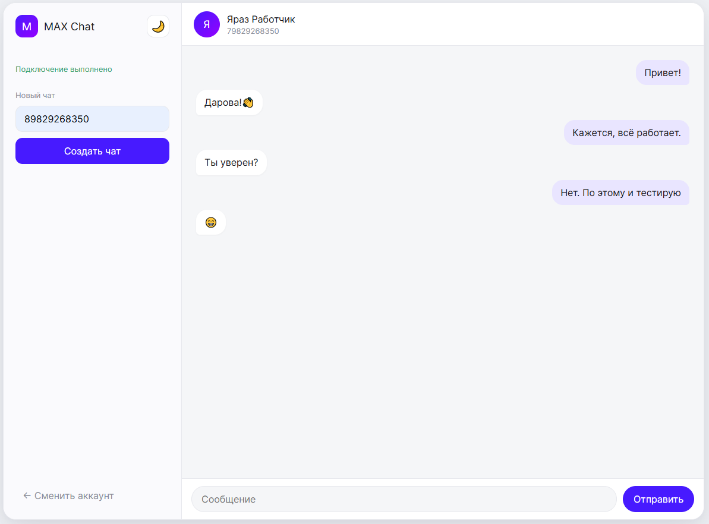
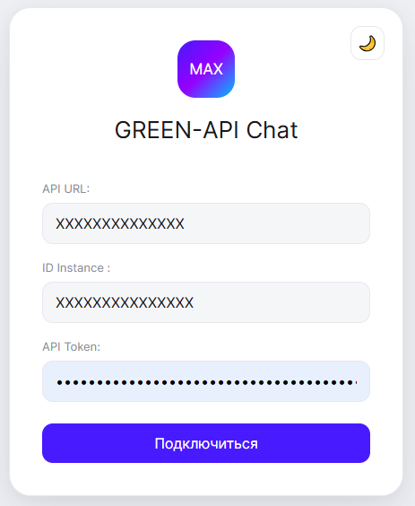
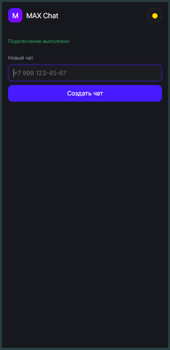

# MAX Chat — GREEN-API

Приложение на React + TypeScript для обмена текстовыми сообщениями в MAX через GREEN-API.

## Live Demo

https://max-chat-green-4ncdpntta-devlyashows-projects.vercel.app/

## Screenshots

<p align="center">
  <strong>Desktop Chat</strong>
</p>

<p align="center">
  
</p>

<table>
  <tr>
    <td align="center" width="33%">
      <strong>Authorization</strong><br><br>
      
    </td>
    <td align="center" width="33%">
      <strong>Mobile</strong><br><br>
      
    </td>
    <td align="center" width="33%">
      <strong>Dark theme</strong><br><br>
      
    </td>
  </tr>
</table>

## Возможности

- Подключение к GREEN-API по API URL, ID Instance и API Token Instance
- Проверка существования пользователя MAX по номеру телефона
- Создание чата
- Отправка текстовых сообщений
- Получение входящих сообщений через HTTP API
- Автоматический polling входящих сообщений
- Отправка сообщения по Enter
- Получение информации о контакте
- Светлая и тёмная тема
- Адаптивный интерфейс для мобильных устройств

## Стек

- React
- TypeScript
- Vite
- GREEN-API
- CSS
- Vercel

## Запуск проекта

Клонировать репозиторий:

```bash
git clone <URL-ТВОЕГО-РЕПОЗИТОРИЯ>
```
